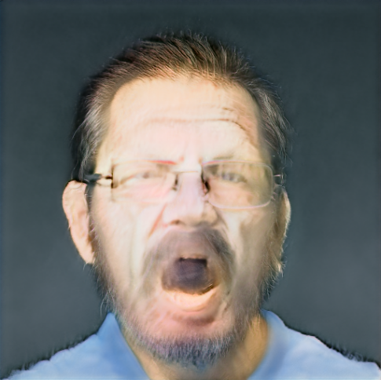
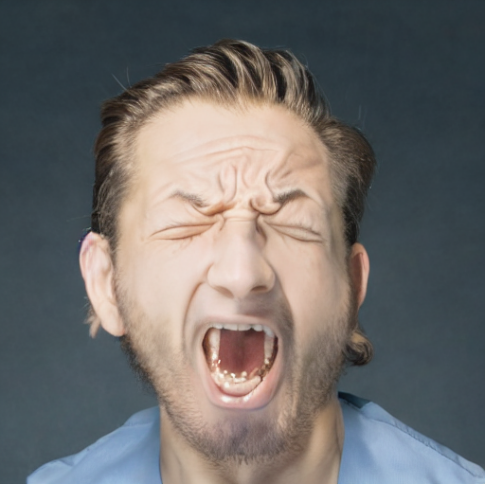
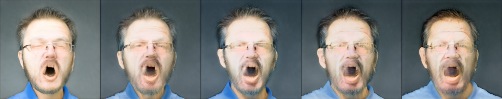
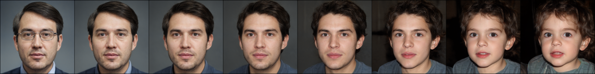

# Latent Space-Driven Face Generation with CLIP and Diffusion

A deep learning project that generates high-resolution, text-described faces by orchestrating a self-trained DCGAN, a pre-trained StyleGAN2, OpenAI's CLIP, and a Diffusion-based refiner.


---

## 📜 Table of Contents

- [Project Overview](#-project-overview)
- [✨ Key Features](#-key-features)
- [🔧 Technology Stack](#-technology-stack)
- [🖼️ Results & Examples](#️-results--examples)
- [⚙️ Setup and Usage](#️-setup-and-usage)
- [🏛️ Architecture](#️-architecture)
- [🤝 Acknowledgments](#-acknowledgments)

---

## 📝 Project Overview

This project explores the synergy between several cutting-edge generative models to achieve text-guided synthetic face generation. The pipeline starts with a simple DCGAN trained from scratch to generate low-resolution faces. An image from this self-trained model is then used to provide a "style" influence for a more powerful, pre-trained StyleGAN2 model. Using OpenAI's CLIP model as a multi-modal compass, the StyleGAN's latent space is optimized to generate a high-resolution face that aligns with a user-provided text prompt. Finally, a Diffusion model is employed to refine the generated image, enhancing details and photorealism.

---

## ✨ Key Features

* **DCGAN Training**: Demonstrates foundational knowledge by training a Deep Convolutional GAN from scratch on the CelebA dataset for 15 epochs.
* **Text-to-Image Generation**: Leverages the semantic power of CLIP to guide a pre-trained StyleGAN2, generating 256x256 faces from textual descriptions (e.g., "a smiling woman with blonde hair").
* **Novel Style Influence**: Uniquely utilizes the output from the self-trained DCGAN as a visual style embedding to influence the final high-resolution generation.
* **Diffusion Refinement**: Integrates a Diffusion model as a final "finishing" step to enhance the quality, details, and realism of the generated faces.

---

## 🔧 Technology Stack

* **Frameworks**: PyTorch, Jupyter
* **Models**: Custom DCGAN, StyleGAN2 (pre-trained), CLIP (ViT-B/32), Stable Diffusion
* **Libraries**: Hugging Face `diffusers`, `transformers`, `torchvision`, `numpy`, `matplotlib`

---

## 🖼️ Results & Examples

This section showcases the visual results of the project, from the foundational DCGAN training to the final, high-resolution, text-guided output.

---

#### Text-Guided Generation & Refinement

The core success of the project is its ability to generate high-resolution faces from text prompts and then enhance them using a Diffusion model. This table demonstrates the clear improvement in detail and realism after the refinement step.

| <div align="center">Prompt</div> | <div align="center">StyleGAN+CLIP Output</div> | <div align="center">Final Diffusion Output</div> |
| :---: | :---: | :---: |
| "A photo of a man yelling with anger" | <div align="center"></div> | <div align="center"></div> |

---

#### DCGAN Style Influence

A unique feature of this pipeline is its use of a custom-trained DCGAN to influence the final output. The low-resolution image from the DCGAN provides a "style blueprint" that is encoded by CLIP and used as a secondary target during optimization, directly linking the two project parts.

 &#8594; 

---

#### Part 1: DCGAN Training Progress

To demonstrate the foundational model training, the images below show the progression of the DCGAN's output over 15 epochs. The model clearly learns to generate recognizable, albeit low-resolution, facial structures from random noise.



---

#### Part 2: Exploring the StyleGAN Latent Space

Beyond single-image generation, we can explore the rich latent space of the pre-trained StyleGAN model.

##### Latent Space Interpolation

This image grid shows discrete steps in a "walk" through the latent space between two semantic points ("old face" and "young face"). It demonstrates the model's ability to smoothly transition between concepts and the rich, continuous nature of the feature space.



##### Single-Vector Semantic Manipulation

This image explores the effect of manipulating a single semantic vector ("age") on a source face. While the model successfully adds features associated with age, it also highlights the limitations of simple, linear vector manipulation, which can sometimes affect other facial attributes in unintended ways. This serves as an interesting point of analysis for the model's capabilities.


## ⚙️ Setup and Usage

1.  **Clone the repository:**
    ```bash
    git clone [https://github.com/your-username/your-project-name.git](https://github.com/your-username/your-project-name.git)
    cd your-project-name
    ```
2.  **Set up the environment:**
    *It is recommended to use a virtual environment.*
    ```bash
    pip install -r requirements.txt
    ```
3.  **Download Models:**
    The project uses a mix of a custom-trained model and several pre-trained models. While most are downloaded automatically by the code, the custom DCGAN model must be downloaded manually. Direct links for all models are provided below for reference.
    
    * **Custom DCGAN Model (Manual Download Required):**
        * **File:** `dcgan_epoch_15.pth`
        * **Description:** This is the DCGAN model trained for 15 epochs on the CelebA dataset as part of the first notebook (`DCGAN_Train.ipynb`). It is used to provide the initial style influence in the main pipeline.
        * **Download:** `[dcgan_epoch_15.pth]` *(https://drive.google.com/file/d/1aP2roQO3suEnJGNbzRF6QMPpuYF8MxZM/view?usp=sharing)*

    * **Pre-trained Models (Downloaded Automatically by Notebook):**
        * **StyleGAN2-ADA (FFHQ 256px):** A powerful, pre-trained StyleGAN2 model from NVIDIA, trained on the FFHQ dataset at 256x256 resolution. This serves as the primary high-resolution face generator.
            * *Reference Link:* [StyleGAN2-ADA PyTorch Repository](https://github.com/NVlabs/stylegan2-ada-pytorch)
        * **OpenAI CLIP (ViT-B/32):** The "Vision Transformer" variant of CLIP is used as the multi-modal compass to understand both text prompts and images, guiding the StyleGAN's latent space optimization.
            * *Reference Link:* [OpenAI CLIP Repository](https://github.com/openai/CLIP)
        * **Stable Diffusion (v1.5):** The `runwayml/stable-diffusion-v1-5` model is used in an image-to-image pipeline as the final refinement step to enhance the details and realism of the generated faces.
            * *Reference Link:* [Stable Diffusion v1.5 Model Card](https://huggingface.co/runwayml/stable-diffusion-v1-5)
      
5.  **Run the Notebooks:**
    The project is split into two notebooks located in the `/code` directory:
    - `DCGAN_Train.ipynb`: To see how the initial DCGAN was trained.
    - `StyleGAN2+CLIP+Diffusion.ipynb`: To run the main generation pipeline.

---

## 🏛️ Architecture

The project follows a multi-stage pipeline:


*(You can easily create this flowchart using a tool like diagrams.net (draw.io) and export it as a PNG)*

---

## 🤝 Acknowledgments

This project builds upon the incredible work of the researchers and developers behind DCGAN, StyleGAN2, CLIP, and Diffusion models.
- [DCGAN Paper](https://arxiv.org/abs/1511.06434)
- [StyleGAN2 Paper](https://arxiv.org/abs/1912.04958)
- [CLIP Paper](https://arxiv.org/abs/2103.00020)
